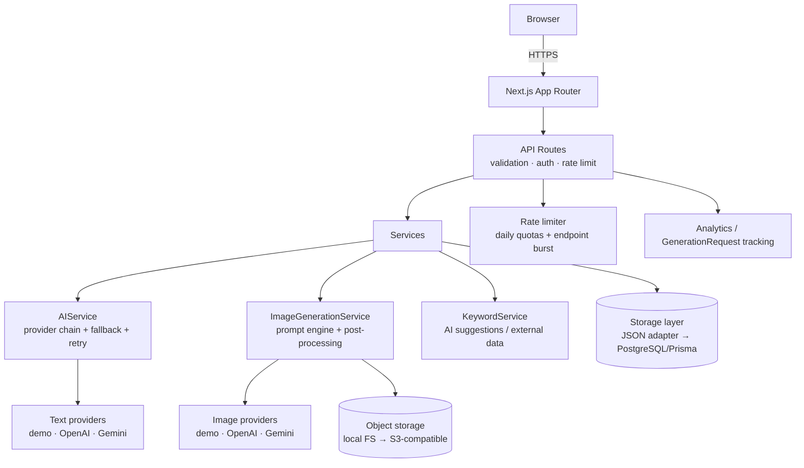

# ChannelForge AI

> **Turn your YouTube idea into a complete channel brand in minutes.**

ChannelForge AI is a production-ready SaaS that takes one channel idea and generates a complete
YouTube launch kit: positioning, channel names, description, keyword sets, content pillars,
40 video ideas (long-form + Shorts), a logo, a 2560×1440 banner with safe-area previews, a
watermark, brand colors and typography — downloadable as one ZIP.

---

## 1. Architecture Overview



**Request path:** Frontend → API layer → Authentication → Validation (Zod) → Business logic →
AI services (with provider fallback) → Database → Storage. No AI key ever reaches the browser.

**Async image pipeline:** `POST /api/generate/*` creates a `GenerationRequest` (job) and returns a
job id immediately. A worker (in-process queue in MVP; swappable for Redis/BullMQ — the DB row is
the contract) runs generation → post-processing → storage. The client polls
`GET /api/jobs/:id` and renders staged progress.

## 2. Project Structure

```
app/                      # App Router: pages + API routes
  api/channel/*           # analyze, names, description, keywords, video-ideas
  api/generate/*          # logo, banner, watermark (async jobs)
  api/tools/image         # standalone image tools (logo/banner/watermark)
  api/jobs/[id]           # job polling
  api/projects, assets    # CRUD, regenerate, file serving, ZIP download
  api/auth/*              # register, login, logout, Google OAuth
  api/admin/stats         # admin metrics (ADMIN_EMAILS gated)
  api/usage, me, track    # quota, identity, analytics events
  api/payments/*          # checkout + webhook (provider abstraction)
  tools/*                 # 6 standalone SEO tool pages
  youtube-channel-generator/[niche]   # 8 niche SEO pages
  blog/[slug]             # structured-block blog (CMS-swappable)
components/               # ui/, site/, landing/, generator/, kit/, tools/, seo/
lib/
  ai/prompts/             # ALL prompts, versioned (…_V1)
  ai/providers/text/      # demo, openai, gemini + chain
  ai/providers/image/     # demo, openai, gemini + chain
  ai/demo/                # offline niche-aware engine (works with no API keys)
  auth/ db/ storage/ rate-limit/ payments/ analytics/ features/ validation/
middleware.ts             # guest cookie issuance
prisma/schema.prisma      # production PostgreSQL schema (migration target)
tests/                    # vitest unit tests
```

## 3. Technology Choices

| Choice | Why |
|---|---|
| Next.js 14 App Router + strict TS | Server components for SEO pages, route handlers for API, one deployable |
| Tailwind CSS + hand-rolled primitives | shadcn-style conventions without the CLI dependency |
| Zod | Single source of truth for request validation **and** AI structured-output validation |
| sharp | Real image post-processing: exact spec sizes, PNG optimization, transparency |
| JSZip | Server-side channel-kit ZIP assembly |
| JSON-file DB adapter (MVP) | Zero-infrastructure start; `prisma/schema.prisma` is the 1:1 PostgreSQL target |
| In-process job queue (MVP) | `GenerationRequest` rows are the durable contract for a Redis/BullMQ swap |

## 4. Local Setup

```bash
npm install
cp .env.example .env.local   # defaults run fully offline (demo providers)
npm run dev                  # http://localhost:3000
npm run build && npm start   # production
npm test                     # vitest unit tests
```

On first boot the app seeds a public demo project (**The Math of AI**) with real generated
assets — no fake data rows, no fake users.

## 5. Environment Variables

See `.env.example`. Key switches:

- `TEXT_AI_PROVIDER` / `IMAGE_AI_PROVIDER` — `demo` (offline engine), `openai`, or `gemini`.
  Comma-separated for fallback chains, e.g. `openai,gemini,demo`. The `demo` provider is always
  appended so the product degrades gracefully instead of erroring.
- `TEXT_AI_API_KEY` / `IMAGE_AI_API_KEY` — required only for paid providers. If a paid provider is
  selected but unconfigured, the API returns a clear configuration error and falls back.
- `ADMIN_EMAILS` — comma-separated emails granted admin dashboard access.
- `LIMIT_*` — daily quotas (anon/free/pro × text/image).
- `PAYMENT_PROVIDER=disabled` — checkout returns an explicit 501 until a provider is wired.
- `NEXT_PUBLIC_ADSENSE_CLIENT_ID` — empty = ad slots render nothing (they never interrupt the
  generation flow and never render for Pro users).

**No secret is exposed to the client.** Only `NEXT_PUBLIC_*` variables ship to the browser.

## 6. Database

MVP adapter: `data/db.json` (single-node). Production target: PostgreSQL via the included
`prisma/schema.prisma` (users, projects, brand_kits, generated_assets, keywords, content_ideas,
generation_requests, usage_events, subscriptions, payments, api_usage, saved_generations,
analytics_events — indexed on hot paths). Image binaries live in object storage; the DB stores
`storage_key`, mime, dimensions, provider.

## 7. AI Provider Setup

`lib/ai/providers/**` isolates every provider-specific call behind `TextAIProvider` /
`ImageAIProvider` interfaces. Adding a provider = one new file + registry entry. Guarantees:

- Structured outputs validated with Zod; one automatic repair pass, then retry, then provider
  fallback, then a user-friendly error (never a stack trace).
- Every call tracked in `generation_requests` (provider, model, status, tokens, est. cost).
- Cost guards: prompt length cap, output token cap, image size cap, 60s timeout, 1 retry.
- The demo text engine is niche-aware and deterministic — the same idea always yields the same kit.

## 8. Testing

```bash
npm test        # unit: schemas, demo-engine contract, JSON repair, plans/limits, safety filter
```

Integration checks verified against the running server: CSRF rejection, input validation,
guest generation → job polling → PNG assets (800×800 / 2560×1440 / 300×300 with alpha),
ZIP kit structure, auth lifecycle, admin gating, per-identity + per-IP daily quotas, endpoint
burst limiting, cascade deletes, and cross-identity authorization.

## 9. SEO

Metadata + canonicals + OG/Twitter cards on every page; JSON-LD (WebSite, SoftwareApplication,
FAQPage, BreadcrumbList, Article); `sitemap.xml` + `robots.txt`; 8 tool landing pages, 8 SEO pages,
8 niche pages, 4 blog posts — each with unique H1/copy/FAQ (no doorway pages); semantic HTML,
visible focus states, reduced-motion support, `prefers-reduced-motion` honored.

## 10. Monetization

Free (quota-limited, ads possible) → Pro ($9/mo architecture). Feature flags in
`lib/features/plans.ts`; `PaymentService` abstraction with a `disabled` provider today —
wire Stripe/Razorpay by implementing `PaymentProvider` (webhook route already validates
server-side; client payment status is never trusted).

## 11. Security Checklist

- ✅ API keys server-only; `.env` gitignored; `NEXT_PUBLIC_*` for public config only
- ✅ scrypt password hashing; httpOnly + SameSite=Lax session cookies
- ✅ CSRF: custom header required on all mutations
- ✅ Zod validation on every request; AI outputs schema-validated; basic content-safety screen
- ✅ Daily quotas per user/guest **and** per IP; endpoint burst limiting
- ✅ Security headers (X-Frame-Options, nosniff, Referrer-Policy, Permissions-Policy)
- ✅ Path-traversal-safe storage keys; owner-checked asset access; cascade deletes
- ✅ Admin gated by role + ADMIN_EMAILS; friendly user-facing errors, detailed structured logs

## 12. Deployment

Any Node host (Vercel, Railway, Fly.io, a $5 VPS). Set the production env vars, run
`npm run build && npm start`. For scale: point `DATABASE_ADAPTER` at Postgres (Prisma schema
included), move jobs to Redis/BullMQ, swap local storage for S3-compatible object storage —
each swap is isolated behind its interface.

## 13. Cost Optimization

- One analysis request produces names + description + keywords + pillars + 40 ideas (no fan-out).
- Demo providers keep dev/CI at $0; paid providers are opt-in per request type.
- Regeneration is per-asset — never regenerates the whole project.
- Token/size/timeout caps and single-retry policy bound worst-case spend; every call is cost-estimated.

## 14. Future Scaling Plan

1. Postgres + Prisma migrate (schema ready) → 2. Redis rate limiting + BullMQ workers →
3. S3 signed URLs (route already isolates serving) → 4. Real keyword API behind KeywordService →
5. Payment provider activation → 6. A/B prompt versions (`*_V2` slots exist) → 7. CDN + ISR.
